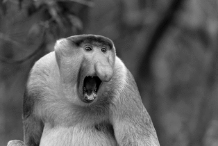
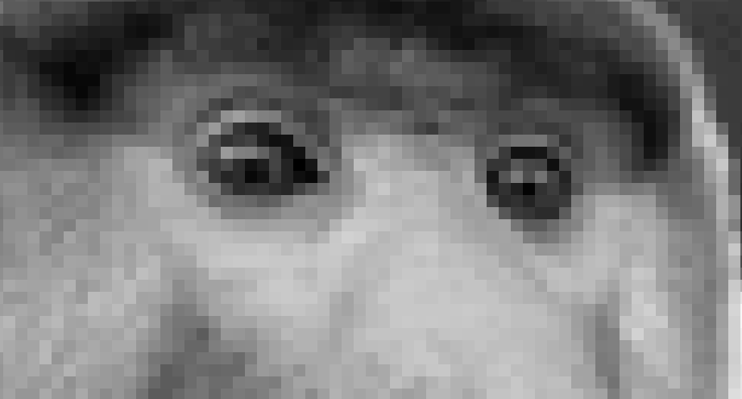
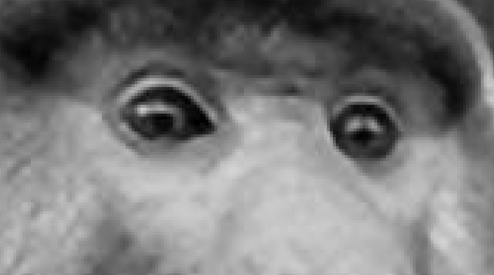

# RSCNN - AI Model for Image Reconstruction

This repository contains **RSCNN**, a neural network designed to enhance image quality through a reconstruction process. The model was trained on a dataset of 144,000 images with dimensions of 256x256 to produce sharp and detailed results after upscaling.

## 🧠 Model Workflow

1. **Training Data Preparation:**
   - Original images were downscaled and blurred.
   - The degraded images were then upscaled to their original size (256x256) using the bicubic algorithm.
   - These degraded images were used as inputs to train the RSCNN model, with the original images serving as references.

2. **Prediction Process:**
   - The model takes an input image, performs an initial upscale using bicubic, and then applies a prediction to generate an enhanced version of the image.
   - The upscale factor is configurable to suit your needs.

## ⚙️ Usage

### Requirements

- Python 3.x
- Torch
- Torchvision

### How to use

Put the path of your image in the main.py function call then launch main.py.

## 🖼️ Example

| Input Image | RSCNN Output |
|-------------|--------------|
|  |  |

### Zoomed

| Input Image zoomed | RSCNN Output zoomed |
|-------------|--------------|
|  |  |

